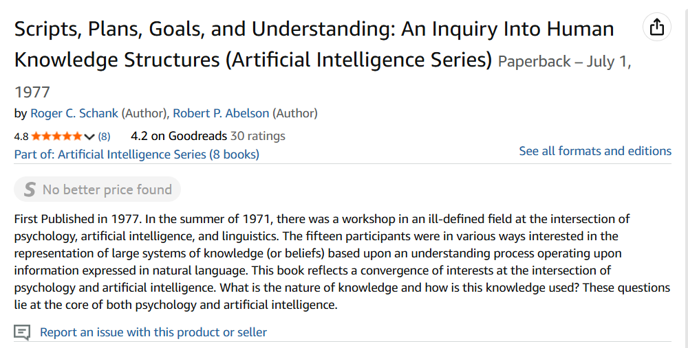

### Introduction
Today i am reading "Unsupervised Learning of Narrative Event Chains." This paper was published in 2008,
and it talks about methods of creating narrative event chains. which are a partially orderted set of 
events that are related to a protaginist (Chambers and Jurafsky 790). To further formalize this statements,
and better integrate it to what we cuurently have, we would say a partially ordered set of events that
encapsulation one or many entities and mutates their attributes. This has the same mechanics as a function
and like a function could be idempontent (“Idempotence”). 

### Additional notes

- representation of structured knowledge

- The more i think of this project i see the intersection between pyschology, linguistisc, and 
artifical intelligence
- this book seems to think about how humans structure information, or as the titled it
juman knowledge strctures 

### Gloassary

Narrative Event Chains - 

Schemata - pural for schema

### References

Chambers, Nathanael, and Dan Jurafsky. “Unsupervised Learning of Narrative Event Chains.” Proceedings of ACL-08: HLT, Association for Computational Linguistics, 2008, pp. 789–797. https://aclanthology.org/P08-1090.pdf

“Idempotence.” Wikipedia, Wikimedia Foundation, https://en.wikipedia.org/wiki/Idempotence
. Accessed 18 Oct. 2025.